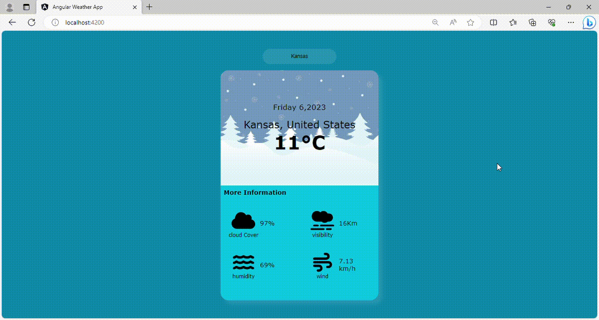

# Weather Angular App

Welcome to the Angular Weather App! This web application allows users to search for weather information, including temperature, visibility, wind, and more, for a specific location by making API calls to a weather data service.

## Features

- User-friendly interface with a search input field.
- Display of temperature, visibility, and wind information for the selected location.
- Real-time weather data retrieved from a weather API.

## Getting Started

Follow these steps to run the Angular Weather App locally on your machine.

### Prerequisites

1. [Node.js](https://nodejs.org/) and [npm](https://www.npmjs.com/) (Node Package Manager) must be installed on your computer.

### Installation

1. Clone this repository to your local machine using Git:

   ```bash
   git clone https://github.com/kinaMouelouel/Weather_Angular_App.git
   ```
2. Navigate to the project directory: 
```cd angular-weather-app```
3. Install project dependencies
```npm install```
### Configuration
1. Obtain an API key from a weather data service (e.g., OpenWeatherMap).

2. Create a configuration file for your API key. In the project root directory, create a file named config.ts and add your API key:
 
 ```bash
 export const environment = {
  apiKey: 'YOUR_API_KEY_HERE',
  production: true,
};
```

##Running the App
1. Start the Angular development server:
 ```bash
 ng serve
 ```

2. Open your web browser and navigate to http://localhost:4200/.

3. You should now see the Angular Weather App running locally on your machine.

## Usage

1. Enter the name of the location you want to check the weather for in the search input field.

2. Click the "Search" button or press Enter to retrieve weather information.

3. The app will display temperature, visibility, and wind data for the selected location.

## API Integration
The Angular Weather App integrates with a weather data service using an API key for real-time weather data retrieval. Be sure to replace YOUR_API_KEY_HERE in the config.ts file with your actual API key.

## Contributing
Contributions are welcome! If you have any suggestions or improvements for the Angular Weather App, feel free to open an issue or create a pull request.

 

 


